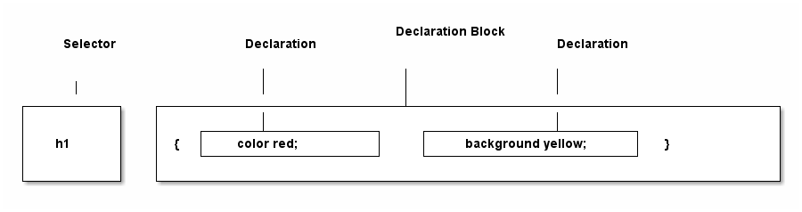

# CSS Selectors #
## Basic Rules ##
A central feature in CSS is its ability to apply certain rules to the entire set of element types in a document.

In old days, you will give the font color in this manner,

````
<h2><font color="gray">This is h2 text</font></h2>
````
but in the CSS world you just need.

**HTML**

````
<h2>This is h2 text</h2>
````
**CSS**
````
h2 {color: gray;}
````

So with one rule you can target all the `<h2>` tags in the document, you do not have to apply `<font>` tag to each `<h2>` tag.

As sample of the above can be found @ [basicRules.html](src/basicRules.html)

### Rule Structure ###

Each CSS Rule has 2 parts:-

1. *selector*

The selector, shown on the left side of the rule, defines which piece of the document will be affected.

2. *declaration block*

The declaration block consist of one or more declarations, and each declarations is a pairing of *property* and *value*



### Element Structure ###
A selector is most often an element in HTML/XML, but not always.See the below code for different type of element selectors.

````
html {color: black;}
h1 {color: gray;}
h2 {color: silver;}
````

## Grouping ##
## Class and ID Selectors ##
## Attribute Selectors ##
## Using Document Structure ##
## Pseudo-Classes and Pseudo-Elements ##


